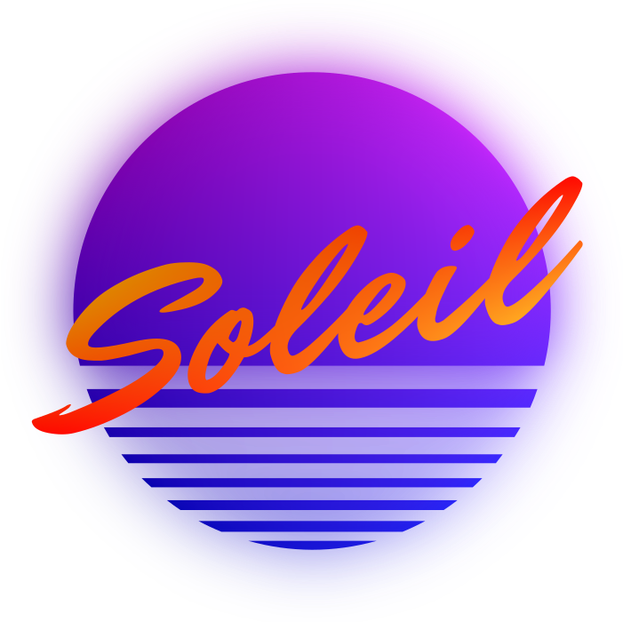
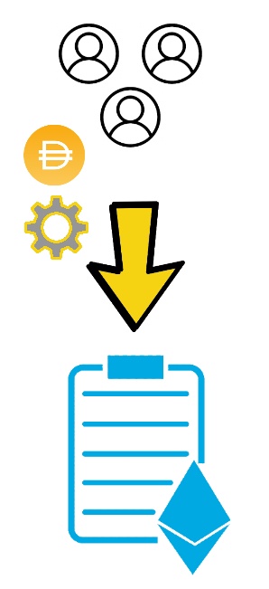
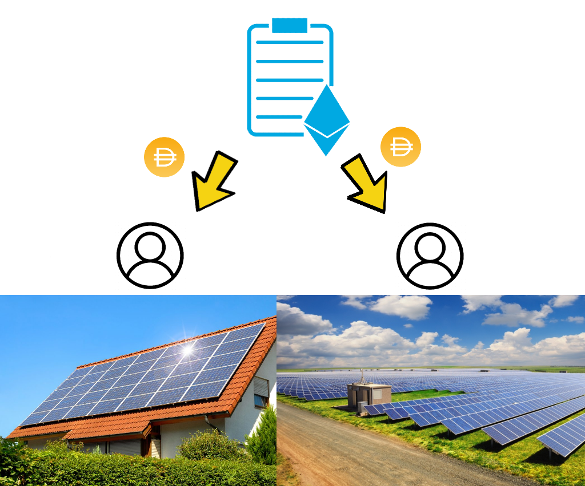
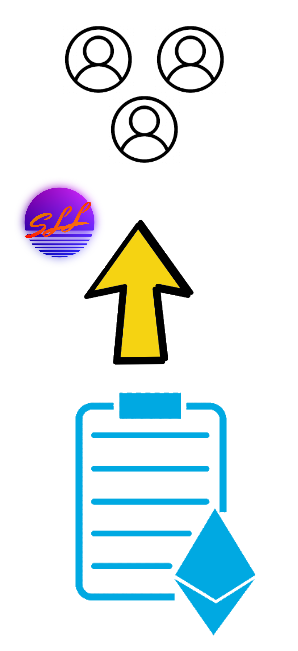
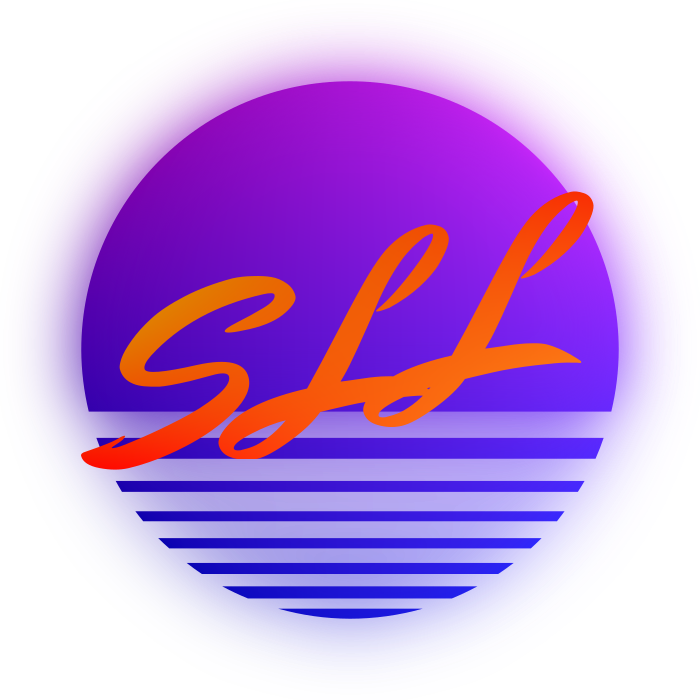
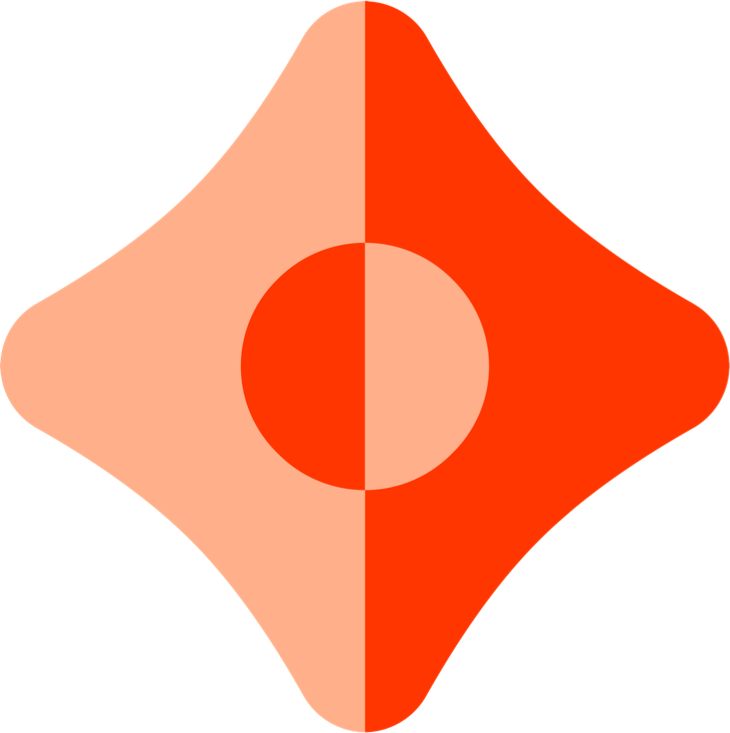

🦸‍♀️🌍🦸‍♂️&nbsp;=
&nbsp;💰🔀&nbsp;
+&nbsp;📈🔍&nbsp;

---

DAI submitted to smart contract and distribution schedule set by user.

> "I would like to donate 200 DAI to solar panel owners gradually over the next 30 days."

--

DAI scheduled to be distributed that day becomes claimable by sites based on the amount of solar energy generated by them on that day.

--

As a reward for helping to fight climate change users are rewarded with SLL tokens.

--

An economy can be grown around the SLL token by anyone who wishes to fight climate change by supporting the growth of the Soleil platform.

*   Services
*   NFT rewards
*   More...

---

Because sites are incentivised to provide their data, we can collate data over a range of providers to build up a large data feed.

Far too much data to feasibly store on-chain.

Ceramic provides a way for us to store a decentralised data stream on top of IPFS which can act as an off-chain data feed.

---

Unlike using IPFS directly, using a Ceramic data stream allows us to point to mutable data with a single address. Streams are built up from of a series of immutable commits.

Soleil uses Chainlink nodes to store three data feeds as streams on Ceramic:

- Energy generated per site
- Cumulative DAI earnings per site
- Cumulative SLL rewards per user

---

## Gas efficient payments

---

Submitting transactions to reward every user with DAI and SLL would use a lot of gas and not allow the platform to scale.

=> Look to a 'cumulative merkle drop' solution

---

Merkle trees are used to facilitate payments of DAI and SLL.

Two custom Chainlink external adapters calculate the merkle root of the cumulative earnings/rewards feeds and submit them to Soleil pool manager contract.

---

Soleil web app looks at our Ceramic data streams to notify the user of how many claimable tokens are available to them.

Also allows them to easily generate a merkle proof against the latest merkle root to submit to the Pool Manager contract to claim their tokens.

---

# Thank you
